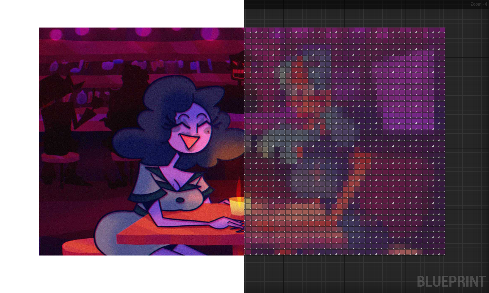

# Blueprinter

A .NET console application that converts pictures into Unreal Engine blueprint nodes.



## Features

- Converts pictures into blueprint nodes
- Supports multiple picture formats
- Supports custom blueprint resolutions (default: 90 nodes height)
- Automatically saves the blueprint to the clipboard

## Usage

### Prerequisites

- .NET 5.0
- [Git](https://git-scm.com/) (optional)

```sh
git clone https://github.com/salmonslay/Blueprinter.git
cd Blueprinter
dotnet run --project Blueprinter
```